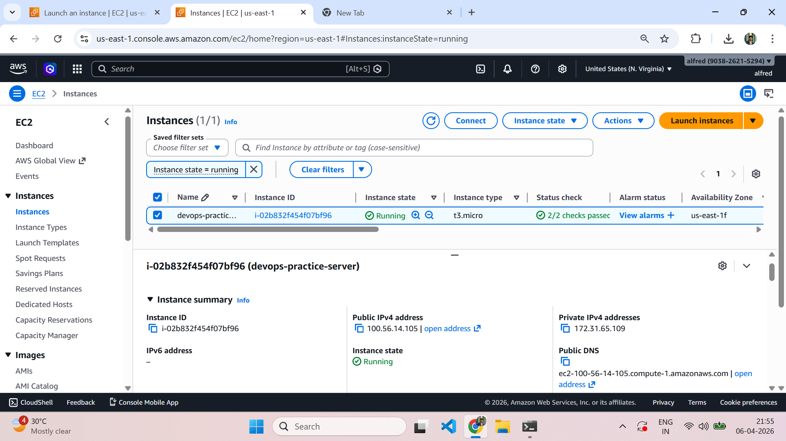
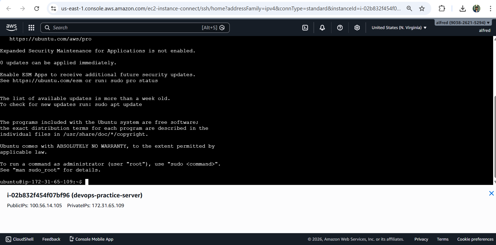
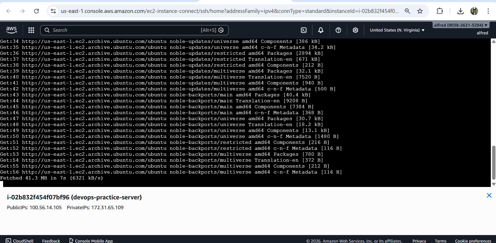
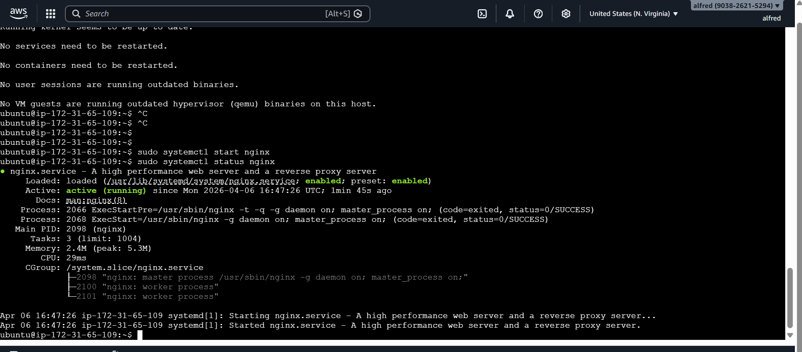
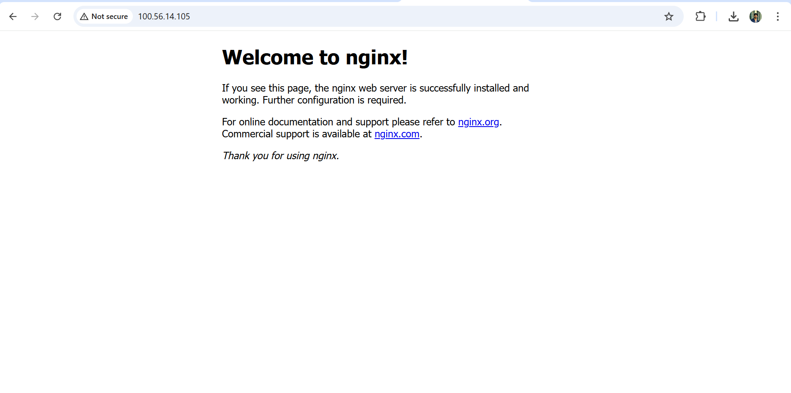
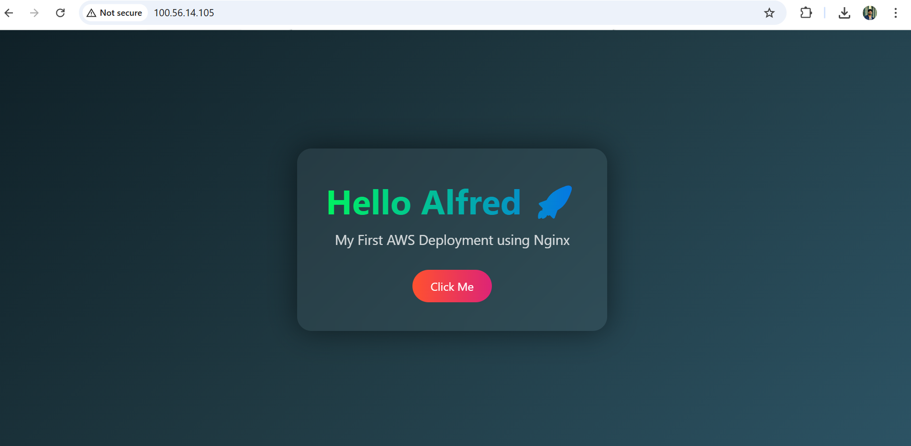

# AWS EC2 Website Deployment 🚀

## 📌 Project Overview
This project demonstrates the deployment of a static website using an EC2 instance on AWS and configuring a web server using Nginx.

---

## 🛠️ Technologies Used
- AWS EC2
- Ubuntu Server
- Nginx
- SSH (EC2 Instance Connect)

---

## 🚀 Implementation Steps

1. Launched an EC2 instance (Ubuntu)
2. Configured security group (Port 22 & 80)
3. Connected via SSH (AWS EC2 Instance Connect)
4. Updated system packages
5. Installed and started Nginx
6. Deployed custom HTML website
7. Accessed via public IP

---

## 🌐 Output
Website successfully deployed and accessed via public IP.

---

## 📸 Screenshots

### 1. EC2 Instance Running

### 2. SSH Connection (Browser)

### 3. System Update

### 4. Nginx Installation

### 5. Nginx Running

### 6. Default Nginx Page

### 7. Custom Website Output

---

## 🧠 Key Learnings
- AWS EC2 basics
- SSH connection using browser
- Nginx setup
- Website deployment

---

## 💰 Cost Optimization
- Used Free Tier
- Stopped instance after usage

---

## 📌 Conclusion
Built a foundational cloud deployment project using AWS.
